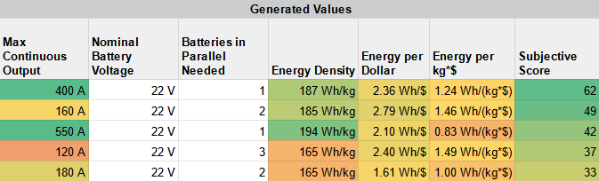

************************************************
Batteries
************************************************

.. figure:: images/uc3.gif
   :scale: 30%

   Under construction

Battery considerations 
==========================

Before you spec your system, you need to understand volts, amps, S rating, C rating, and kilowatts. Here's a start: 

* **Kwh or mAH**: Available battery energy (how much gas is in the tank) is Kwh = volts * amps. (S rating * 3.7 * mAH). Divide available Kwh by how any Kw you need per minute to determine how long you can run your motor. 
* **Voltage**: The S rating indicates the total voltagle. It is the number of cells times the cell voltage (3.7 for LiPO). Most systems use 44.4 volts and higher. You'll may need multiple batteries. Wired in series, voltage is cumulative. Connected in parallel, voltage stays the same. 
* **Amperage-Capacity**: The C rating tells you the flow rate of electricty in and out of the battery. Your battery must be able to supply enough amps (current) to power your motor, and since the motor will try to draw what it needs, you need to use batteries which have a higher dicharge capacity than will be used during max draw (climb). Multiply the C rating by the amp hours to find the max amps. A 16000mAH battery is 16AH. A 10C rating means you can draw 10*16 (160) amps. Wired in series, amperage stays the same. Connected in parallel, amperage is additive. It's a good idea to spec your batteries as well as the ESC with 60-100% headroom (or double what you might need). eHelp drives can pull well over 100 amps.
* **P rating**: The P rating indicates how many parallel strings exist in the battery. Adding parallel strings increases available amperage out of a battery (a higher C rating). For example, 14.8V 5000 mAh 4S2P is a 4-cell  battery consisting of 2 strings of 2500 mAh capacity cells wired in parallel to provide a combined 5000 mAh rating. While a higher P rating increases capacity and discharge rates, it may lower reliability and recharge cycles.
* **Price**: TBD
* **Built-in battery management system**: TBD

The math is easy, but here's a calculator: https://power-calculation.com/battery-storage-calculator.php

.. tip:: Some of the working examples in this document use 2 12S 22000mAH batteries. 

**Research links**

* https://www.genstattu.com/bw/
* https://rightbattery.com/tag/p-rating/

Type
---------------

LiPO batteries are currently the first choice for a number of reasons, including their energy density, high discharge rate, lifespan, and so on. 

.. note:: It's worth reading this `forum snippet <./resources/batterycomparison.pdf>`_ as well as the entire `thread here <https://community.openppg.com/t/new-battery-option-better-power-density/2274/42>`_.

LiPO
^^^^^^^^^^^^^^^^^^^

* Premium: `Tattu, Tattuplus (smart batteries) <https://www.genstattu.com/6s-22-2-v-lipo-battery.html?sort=pricedesc>`_
* Bonkas (see OpenPPG)
* Budget batteries: Example: Zeee are about 1/2 the cost of Tattu. 

LiPO graphene
^^^^^^^^^^^^^^^^^^^

Existing graphene batteries are more hybrid LiPOs than anything else. As of 1/15/22, it does not appear they provide higher energy densities. They do offer increased durability, charge cylcles, and better performance in a number of areas. Do you own reseach. 

Semi solid state LiPO:
^^^^^^^^^^^^^^^^^^^^^^^^^

The technology is rapidly evolving. Manufacturer's claim a higher energy density, lighter weight, higher discharge rates, and a longer cycle life. For example, a 7s 1kw Foxtech setup is around 3 lbs lighter than a Tattu 6s Lipo setup. The C rating is likely two low unless run in parallel.

* `Foxtech spec charts <https://www.foxtechfpv.com/foxtech-diamond-6s-22000mah-semi-solid-state-li-ion-battery.html>`_
* See also Welion, YANGDA Thunder Stone

Size
--------------

Your flying consumes kilowatt hours: Kwh = volts X amps. For example, two 6s (22.2 volts) 22000mAH batteries will = about 1 Kw. How much and what kind of flying you can do with 1 Kwh can't be known until you've gone through the steps in :ref:`spec`.

Weight
---------------

There's not usually a big weight difference per kilowatt across commercial offerings. However, weight matters, so check. The Tattu Plus has extra feature and is therefore heavier. The new semi solid state batteries are lighter but lower C ratings. And so on.

Price
------------------

Cheap batteries are a fire hazard, have short lifespans, and/or perform poorly. Choose wisely.

Battery calculators
=========================

System design
-----------------------------

Designing a power system is easier than choosing a brand. Simply use the calculator below or any `online calculator <ttps://power-calculation.com/battery-storage-calculator.php>`_. The goal is to connect the 1 or more properly sized batteries in series and/or parallel to output the requisite voltage and current.

.. tip:: Live version coming soon! Until then, copy and use `the original here <https://docs.google.com/spreadsheets/d/1ij-Vy3835dhY8Kqg17O_BWjjIVHlTOPBIy46ROsu4YE/edit?usp=sharing>`_.

.. raw:: html

    <iframe src="https://docs.google.com/spreadsheets/d/e/2PACX-1vTfsWeI0qIlAbYbaXaNGYnleZmtXnAgD0Pvbtdmn-Gi2WE_WTBSEzz8cQO_yhCsmRrs5oKbHpNX5LJ6/pubhtml?widget=true&amp;headers=false" scrolling="no"  frameBorder="0" width="800px" height="440px"></iframe>

Price vs energy density
----------------------------

Given their cost and wide ranging pricing, it is worthwhile to compare brands and vendors. You can DIY or start by copying this `calculator spreadsheet <https://docs.google.com/spreadsheets/d/e/2PACX-1vSYhSRpC7a6drAYn5A5jjUZpGrIXOZs654n1BL1cOBiTSKUYMA2WfKppsEGFYbFlsEsGbAhAPfXNEyp/pubhtml>`_.

   Credit OpenPPG forum

DIY battery packs
========================

DIY battery packs may be extra work, but they can be 1/2 the cost, custom sizes, and created in a form factor compatible with the installation method. It's worth checkout out this `OpenPPG post <https://community.openppg.com/t/building-a-14sx15p-18650-battery-pack/2251/22>`_ and Joe's DIY hang glider harness pack below. 

.. raw:: html

  <iframe width="560" height="315" src="https://www.youtube.com/embed/utYveWc6Wrg" title="YouTube video player" frameborder="0" allow="accelerometer; autoplay; clipboard-write; encrypted-media; gyroscope; picture-in-picture" allowfullscreen></iframe>

  
<em>Credit: Joe Stapelton</em>

Worthwhile reading
============================

* Care, use, selection: https://www.rchelicopterfun.com/lipo-batteries.html
* Forum discussion: https://endless-sphere.com/forums/viewtopic.php?t=110570
* `Determining an accurate (real world) C rating <https://www.youtube.com/watch?v=xwxFQy-jqZ0>`_
* TBD add vid link: why choose a high C value battery. 
* TBD add vid link: why high voltage is better

