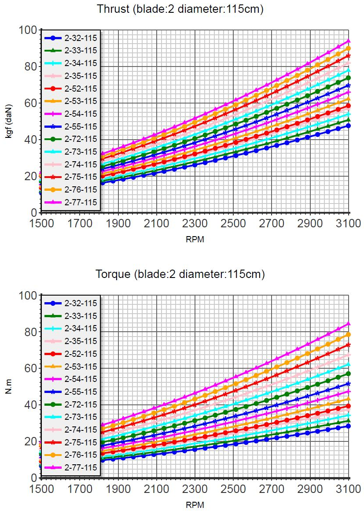

Notes, todo, not reviewed
=================================

Joe Stapleton: https://www.facebook.com/groups/904566026835865/permalink/946245972667870/?comment_id=952365935389207&notif_id=1639134326519757&notif_t=group_comment&ref=notif

There is some extreme confusion going on here, you really can't use KV (no load RPM per volt) to try and determine prop RPM directly. KV is simply the inverse of KT the torque constant. KT tells you how much torque your motor will produce per amp. Applying a specific torque to your prop will generate a specific thrust, irrespective of airspeed. All that happens as your airspeed increases if you keep the torque/current the same is the RPM increases and therefore the power since power = torque x RPM.

What you need to make any meaningful prediction is the torque to thrust curve for your prop, this is available from reputable prop manufactures such as e-prop.

To try an illustrate the relationship between KV, KT, torque, current, voltage and thrust please look at the example e-prop curves below I just picked some random 2 blade family. If you look at the lowest blue lines on both charts these represent the lowest pitch prop in that family. So say you decide you want 40kg of thrust from this prop, you read across the top chart and see you need to spin it at ~2800RPM. Now look at the lower chart and see that at 2800RPM you need ~25Nm of torque.

So say we want use a 50KV motor, we convert from RPM/V to SI units (Radians per second per volt) then invert it to get KT. In one step you can do this by KT = 9.55/KV = 9.55/50 = 0.19Nm/A, i.e. for every amp we put through the motor it will produce 0.19Nm of torque.

So we can now calculate the phase current we need to produce 25Nm of torque which will spin our prop at 2800RPM and generate 40kg of thrust, simply 25/0.19 = 131A. Finally at 2800RPM our motor will be generating a back EMF of 2800/50 = 56V. So we need a battery of at least 56V to do this otherwise the system will never reach this RPM. If we are planning to fly then we need a higher voltage as the prop RPM will increase with airspeed.

Hopefully it is obvious that this is all true whether the motor is 1000kg electric train or a 10 gram rc model motor. This is why the continuous current, max voltage / max RPM of the motor are also important.

-----------------------

Let's pretend these numbers are accurate.

Questions:

If watts = v * a, can we assume that reducing v and increasing the amps results in the same input power as above? For example, 98*61 is about 6kw. Could we use 55v for batteries and assume that if we set the throttle to draw 109 amps we'd have the same input power? The math works, but does the system perform that way? 

    Q1. yes Watts =VI. For you yes its the same. What you will find with the controller is that if you set the power limits and current limits then its can act a bit like a transformer so when say you have 50% throttle and the prop needs more power it will draw more current up to the maximums. So say your maximum current was 180A it could draw that but in reality the power demand from the propeller is a parabolic / geometric curve so at partial rpms ie not maximum the current requirement wont be your maximum current setting. It also means that as the battery volatge drains down it will want to keep the same power and do that by addimng current.

RPM = Kv*volts So published KV numbers are always no load numbers and also = max RPM? 

    Q2. The Kv is no load becaus ereally its a measure of the back emf the motor makes as a generator. Its just that the common vanacular interpretation is volts applied = rpm but if you dont exceed the maximum torque thats also what you should expect to be able to spin the propeller up to. I've etsted under loads and it does pretty well. I will send you my latest Part 2 it may help. The rpm is governed by the voltage and kv rating in theory. the torque is the reciprocal of kv which is Kt and thats multiplied by the maximum current your motor can handle. I use max constinuous to prevent things from melting.. That combination determines your torque. .Knowing your output power and dividing that by your toque gives tyou your rpm. You have to do a bit of manipulation to keep the units correct as rpm isnt SI but it works out in the wash.

So the RPM is the number Kv*V*(some reduction factor caused by the prop) in real use. Is there a formula (that's not too complex) to guesstimate the RPM reduction caused by a props diameter/pitch?

    Q3. I do allow an 80% efficiency factor when I am calculating the output power. So for example is you had 52v in and a maximum current of 180A I would times them together and then by 0.8 to give me a maximum power of 7.5kW. That would be the power I would use if I was trying to match a propeller to it. Basically if your propeller wants more power then it means also the torque demand is too much so what will happen is that it will reduce in rpm. The power requirement will drop and an equilibrium spot will be found. Or another way to do it is that you can actually set your controller so the motor will only spin to a maximum speed. say that calculated when your batteries are at the lower end. The propeller wont spin and faster even if you have more power. So when the battery is fresh you have more torque than you need and when low down you still have just enough.

    xxx

    https://www.rchelicopterfun.com/lipo-batteries.html

    xxx

PM: Manufacturer’s data suggest that the 12090 has a maximum rated current quoted around 180A and that drops to about 140A for maximum continuous. I’ve seen propeller data using a 12090 run at 138A but for how long is still a mystery. Bench testing results suggests that the maximum value may be only sustainable for a few minutes before the motor becomes very hot or gets to around 120C which may be a critical insulation temperature. Alien datasheets suggest that the peak power is 15kW and the continuous rated is 7.5kW. The maximum rated voltage is 70v which suggests that the peak current is around 214A and the continual rating half that at 107A. But the continual rating is likely to be for at least 60 minutes so a simple two point line may be plotted as shown in Figure 1. Pragmatically, most e-help set up aren’t likely to run in total for more than 30 minutes and that would be the case for a flat land take-off, which is even more infrequent. Testing of the motor does not appear to include a forward velocity and the effect of cooling the moving air would have. But as a safe starting point without being over conservative take the peak current and divide by √2.

Looking at it in very simple thermodynamic and heat transfer terms, the heat is generated by the product of current2 x resistance because heat transfer is measured in watts. The current doubles in magnitude so quadruples its contribution to the heating equation. If it is assumed that the steady state temperature is around 80C and peak 120C then the increase in winding resistance due to the 40C temperature rise equates to 0.393% per C or 15.7% and the nett effect is 4.63 times increase in heat generated to be dissipated. Based on these assumptions setting a maximum current (continuous for e-help purposes) at √2 of the peak it would be expected that the motor running temperature would comfortably remain under 100C. As motors seem to have a 180C rating for the wire and 220C for the magnets the thinking is that the possible running temperature is a safe way off those limits. 

nikita: 1 604 725 5889

xxx

From: https://endless-sphere.com/forums/viewtopic.php?t=110570#p1626972

xxx

torque is about 60% thrust? : Q4  Ive never looked it that way but you are close. Thrust is power out x propeller efficiency. At the zero sink tootling about the efficiecncy will be about 55% and full power climb its 42%. again my Part 2 notes have some graphs in fact my Part 1 I loaded up today or yesterday has a graph at the end. I plotted efficiency against what is known as advance ratio. It was buigging me so much that prop data was scarce I created my oen. Thats one of the reasons why I am buy a range of props. I am testing them as I go so the calculations and assumptions get more and more accurate.

xxx

Google sheets 

GS to tables: 

* table from web app; https://www.bpwebs.com/pull-data-from-google-sheets-to-html-table
* https://dev.crunchprank.net/google-sheets-to-html/

Embed GS and keep it editable: https://www.localwebstrategies.com/post/how-to-embed-editable-google-sheets-in-website

https://tableizer.journalistopia.com/tableizer.php

CSS: 

* https://cssgradient.io/

xxx

3d printing and cf compression molding

xxx

.. container:: twocol

.. container:: leftcolumn

   .. figure:: images/ca_fusion.png
         :scale: 100%

         Design by Charles Allen

.. container:: rightcolumn

      The systems are relatively simple and free of tune ups, maintenance hassles, and fossil fuels. Like most flight, there are some caveats and hazards, but the ehelp idea has one moving part and many advantages. A community of pioneers are paving the runway with free advice, open source plans, and Youtube videos while the multi-billion dollar drone, battery, and EV industries quickly drive the evolution of cheaper, lighter, and more powerful components.  

      In a few years, we'll like have lighter and more powerful motors (axial), smaller and safer batteries (solid state, and (with luck) commercial ready-to-fly choices, kits, manuals, and parts.
      

xxx

reset css: https://stackoverflow.com/questions/43629317/reset-all-css-for-one-element-and-its-children
