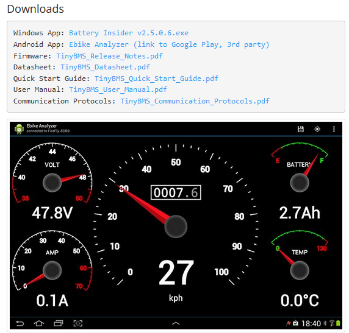

************************************************
Instrumentation, Telemetry
************************************************

.. figure:: images/uc1.gif

TBD: overview

Telemetry
======================

TBD: what data you want and where it comes from. 

table: bms vs es

Nikita notes: 

data from ESC
sends data 22bytes of data coni: rpm battery level, current, :
Arduino: listens for data. ADP documents how to parse
ADP provides code, just do code. Cus5tomer: need to 
Arduino: complex. Choose python over C++

 doesn't know temp: hook up thermistors to batteries and motor. 

bms features: 
temp probe
temp
voltage
current
charge remaining, capacity
indiv cell monitoring

esc
rpm 
internal temp
input v
bus current
phase current
power
throttle input
motor duty cycle

Connections
-----------------------

bluetooth, hardwired

Battery managent system
=================================

https://www.energusps.com/shop/product/tiny-bms-s516-150a-750a-36

Instrumentation
======================

TBD. CA has a slick contraption in one of his vids. 

.. figure:: images/cainstrument.png

* OpenPPG board: https://openppg.com/shop/paramotors/replacement-parts/frame-pcb/
* 

Battery monitoring
----------------------------------

Motor monitoring
-----------------------------

tbd, notes, todo
===========================

bratwurst (from openPPG)

Hi Peter,

The fact is that all displays that I have sold to pilots have worked flawlessly to this day. everyone used it for what it was intended for. if you want a system that is completely individual for you, you will find many companies that specialize in it. I and all my colleagues will continue to fly with the 18063, 25063, 50063 for the next few years. never change a perfectly functioning system is my opinion.

xxx

re: PCB board: 

The system is the controller that comes with the X4 or sp140, depending on which one to want to monitor. I’m not sure exactly what you want to display but both controllers already show most of the relevant info. It’s probably easier than you think to simply modify the open source code and assemble your own Arduino with a screen to display what you want.

xxx

https://community.openppg.com/t/paraglider-self-launching-system/2186/18

Are you saying 4 meters of wire between the batteries and ESC or between the ESC and the motor? Are you familiar with voltage spikes from induction caused by long wires. You will burn up your ESC if the wires between the batteries and the ESC are too long. Search induction on this forum for more details.

additional info about heat, loads, props, motors

xxx

https://community.openppg.com/t/sp140-motor-sold-separately/3084/4

hello, all you need is a standard throttle or cameleon 2/3 and connect it to a linear potentiometer. a tension spring and a return spring depending on how the handling should be. i always set it like the spring pressure on petrol ppg. also from the distance. so i was able to fly about 50 pilots with my e ppg without someone having noticed a difference when accelerating to a petrol ppg. only at thermik eppg do i use my different throttle system which has a utility model protection at the german patent office in munich. However, this is only useful for thermal / ascent eppg. if you want to see pictures of components (poti, electronics etc.) i can make some.

xxx

prebuilt throttle with telemetry: https://ppgsmoke.com/products/smart-throttle

xxx

https://usa.banggood.com/DALY-Smart-BMS-Accessory-bluetooth-Module-USB-to-UART-or-RS485-Cable-CANbus-Module-Power-Display-Panel-Touch-LCD-Screen-p-1872195.html?utm_source=googleshopping&utm_medium=cpc_organic&gmcCountry=US&utm_content=minha&utm_campaign=minha-usg-pc&currency=USD&cur_warehouse=CN&createTmp=1&ID=6310487&utm_source=googleshopping&utm_medium=cpc_bgs&utm_content=sandra&utm_campaign=sandra-pla-usg-all-0506&ad_id=519518637596&gclid=Cj0KCQiAwqCOBhCdARIsAEPyW9kt19-gqlxlKW-USW0PbmHttu5lexbUaQ_X9HCoDZh_qG4-9i9D6wsaApAiEALw_wcB

https://www.lithiumbatterypcb.com/product/13s-to-20s-li-ion-or-lifepo4-smart-bms-relay-solution/

https://www.aliexpress.com/item/4001202028077.html?spm=a2g0o.productlist.0.0.6efb3d73dFSwNi&algo_pvid=44317b5a-bac3-4c98-a688-1253b79ffbe5&algo_exp_id=44317b5a-bac3-4c98-a688-1253b79ffbe5-13&pdp_ext_f=%7B%22sku_id%22%3A%2212000022994987764%22%7D&pdp_pi=-1%3B48.72%3B-1%3B-1%400%3BUSD%3Bsearch-mainSearch

bms features: 
temp probe
temp
voltage
current
charge remaining, capacity
indiv cell monitoring
current control
charge/discharge balancing and protections
bluetooth
parallel battery connections (check!)
weight

