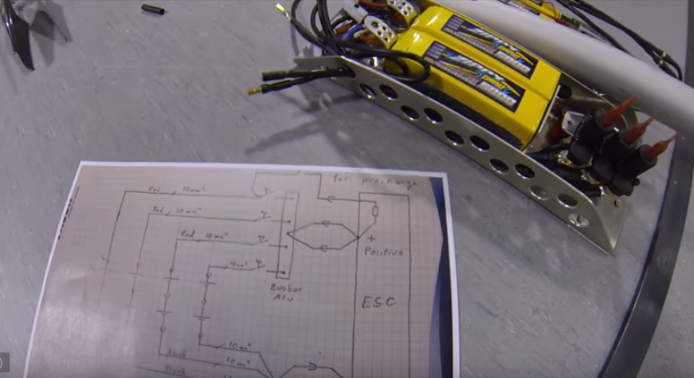
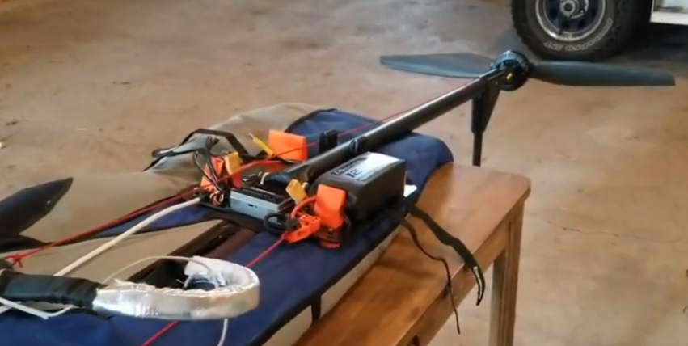
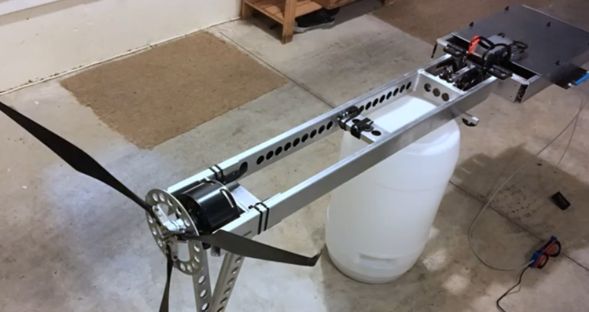
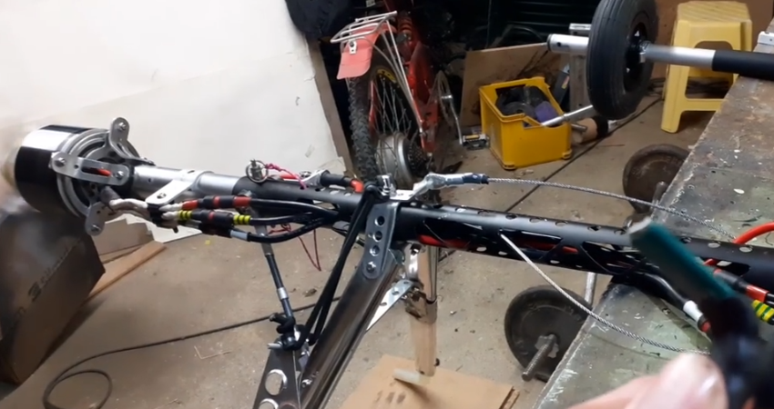

************************************************
Eharness Examples
************************************************

.. figure:: images/uc3.gif
   :scale: 30%

   Under construction

This page provides links to examples of working systems. 

.. _workingbuild: 

Working build database
============================

In progress: Community-driven list of functional systems.

`Edit or copy the database <https://docs.google.com/spreadsheets/d/17SzHl_S5aJjG43wHJqSCtoEecXG1U_SxYxlZpuQb4QI/edit?usp=sharing>`_

.. raw:: html

   <!-- Table sorter -->
   <link href="tablesorter/theme.default.css" rel="stylesheet">
   
   
      <table class="table tablesorter">
         <thead id="table-head"></thead>
         <tbody id="table-body"></tbody>
      </table>
   <!-- Table -->

   <!-- MDB ESSENTIAL -->
   
   <!-- Google API -->
   
   <!-- easyData -->
   

   <!-- easyData - Creating table -->
   

Eharness videos
================================

* Reidar Bernsten eharness builds: 
  
   * `Reverse engineered look (part 1) <https://www.youtube.com/watch?v=KIY1k8jz4v0>`_
   * `How it is made (part 2) <https://www.youtube.com/watch?v=kuN8h2oR7L4>`_
   * Two eharness flight tests: https://www.youtube.com/watch?v=aSM9u3zkhDI
   * E-Help Prep for flatland footstart flight: https://www.youtube.com/watch?v=mm0PRii-jXs>
   * Flying tutorial: https://www.youtube.com/watch?v=hk-2uNuh5YU

      Credit: Reidar Bernsten

* Charles Allen eharness build: 
  
      * `Build video with specs <https://www.youtube.com/watch?v=kMv0oyVrDfs>`_
      * `Fly video <https://www.myqnapcloud.com/share/6d31j23k4l6p70551946x13z_696R5Pm#/home>`_
      * `Design files + BOM <https://www.myqnapcloud.com/share/6d31j23k4l6p70551946x13z_696R5Pm#/home>`_

   Credit: Charles Allen

* `Brenden (last name tbd) build video with BOM and details <https://www.youtube.com/watch?v=d3AuHhnzxZA>`_

   Credit: Brendan

* `Paul Martin build video (requires permission for access) <https://www.facebook.com/groups/668143127181552/posts/853592028636660/?comment_id=871739653488564&reply_comment_id=871853686810494&notif_id=1639125691695281&notif_t=group_comment&ref=notif>`_

   Credit: Paul Martin

Commercial e-harness systems
=============================================

* https://toniroth.com/
