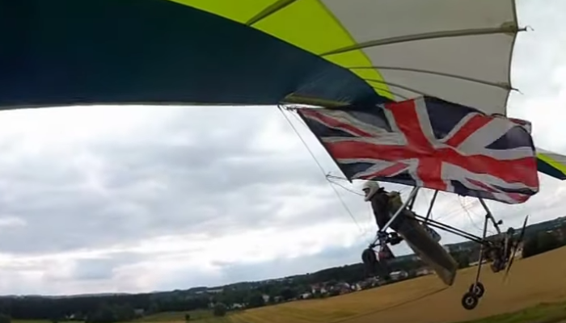
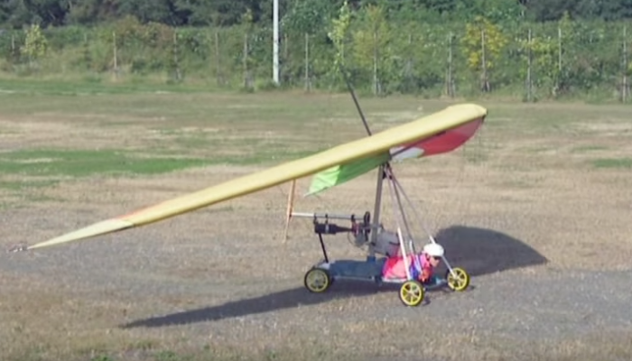

************************************************
Ideas and Related Experiments
************************************************

This document does not include trikes, ultralights, and paramotors. However, interesting rigs with unique or related ideas may appear here. 

Prone launch configurations
================================

* `Reidar's twin electric tractor <>`_
* `Reidar's  bowsprit launch dolly <>`_
* `Keel-harness hybrid frame <https://www.youtube.com/watch?v=UyrObtpiGWA&t=3s>`_

* Japanese prone setup: 
  
   * https://www.youtube.com/watch?v=82-JIf86bYs
   * https://www.youtube.com/watch?v=ZKZ9CX1SIWo
   * Wheeled, one vertical support, very lightweight

Propellers
================================

* Passive variable pitch prop: https://www.facebook.com/groups/904566026835865/permalink/944285446197256
* Contra-rotating prop: 
    * https://www.crflight.com/?utm_source=unmannedsystemstechnology.com&utm_medium=referral
    * PPG discussion: https://community.openppg.com/t/co-axial-motors-with-counter-rotating-props/114

* `Hub <https://www.f3aunlimited.com/airplane-accessories/falcon-82mm-carbon-fiber-spinner-with-cnc-cooling>`_. Functional but for tractor setups only. 

Trike-ish
====================

* Commercial seated trike-like setup: https://www.altigenerator.com/

From Paraglider land
========================

* Justin's paraglider Blimp drive. Interesting twin off-the-shelf parts setup. http://www.justine-haupt.com/blimpdrive/
