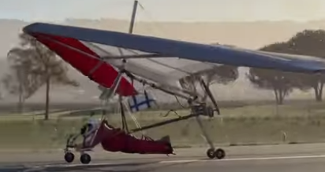
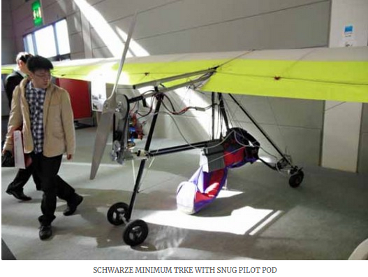

************************************************
Ideas and Experiments
************************************************

This document does not include trikes, ultralights, and paramotors. However, interesting rigs with unique or related ideas may appear here. Please forward any videos you find inspiring. 

Prone launch configurations
================================

The reason I include these here is because prone launching removes the need to control a throttle and glider during a running launch. There's no immediate altitude with a flat land launch so simplicity has its advantages.

Reidar Bernsten

* `Twin electric tractor <https://www.youtube.com/watch?v=z-OrT9RGfFI>`_
* `E-Help R&D 2017, the bowsprit Dolly and rewound motor <https://www.youtube.com/watch?v=VLn4_wpWyus>`_
* `Keel-harness hybrid frame <https://www.youtube.com/watch?v=UyrObtpiGWA&t=3s>`_

.. figure:: images/bielfeldprone.png

Japanese prone setup: 
  
* https://www.youtube.com/watch?v=82-JIf86bYs
* https://www.youtube.com/watch?v=ZKZ9CX1SIWo

.. figure:: images/jprone.png

Ivan Melero `double tail wheel (not electric) <https://www.youtube.com/watch?v=lNPEsNZPsUg>`_

Schwarze Minimum Trike

Not electric, but some prone configurations: 

* https://www.youtube.com/watch?v=7in0pW-uOF0
* Flyped: https://www.youtube.com/watch?v=gynjOMZDDJo
* https://www.youtube.com/watch?v=7BBTrvMpG30

Sustainers
======================

* Charles Allen's cool on-the-keel twin XTM 5500 `build video <https://www.youtube.com/watch?v=oqqEOvN7l8I>`_ and flight video:

.. raw:: html

    <iframe width="560" height="315" src="https://www.youtube.com/embed/2QEa9IL_ZlM" title="YouTube video player" frameborder="0" allow="accelerometer; autoplay; clipboard-write; encrypted-media; gyroscope; picture-in-picture" allowfullscreen></iframe>

Seated
=================================

* `PPG-like backpack <https://www.youtube.com/watch?v=Q0gEOvI-T_s>`_
* `Altigenerator. Interesting keel mount <https://www.youtube.com/watch?v=nPbz7o6wtM0>`_
* `Very lightweight Russian design (seated but could be prone) <https://www.youtube.com/watch?v=KkwsizoLIQ8>`_
* Interesting ideas: suprone, wheels: https://www.youtube.com/watch?v=npBn50XRphA

Trike-ish
====================

* Commercial seated trike-like setup: https://www.altigenerator.com/
* Footlaunch-able trike: https://www.youtube.com/watch?v=pa61ZeByFuM

From Paraglider-land
========================

* Justin's paraglider Blimp drive. Interesting twin off-the-shelf parts setup. http://www.justine-haupt.com/blimpdrive/

