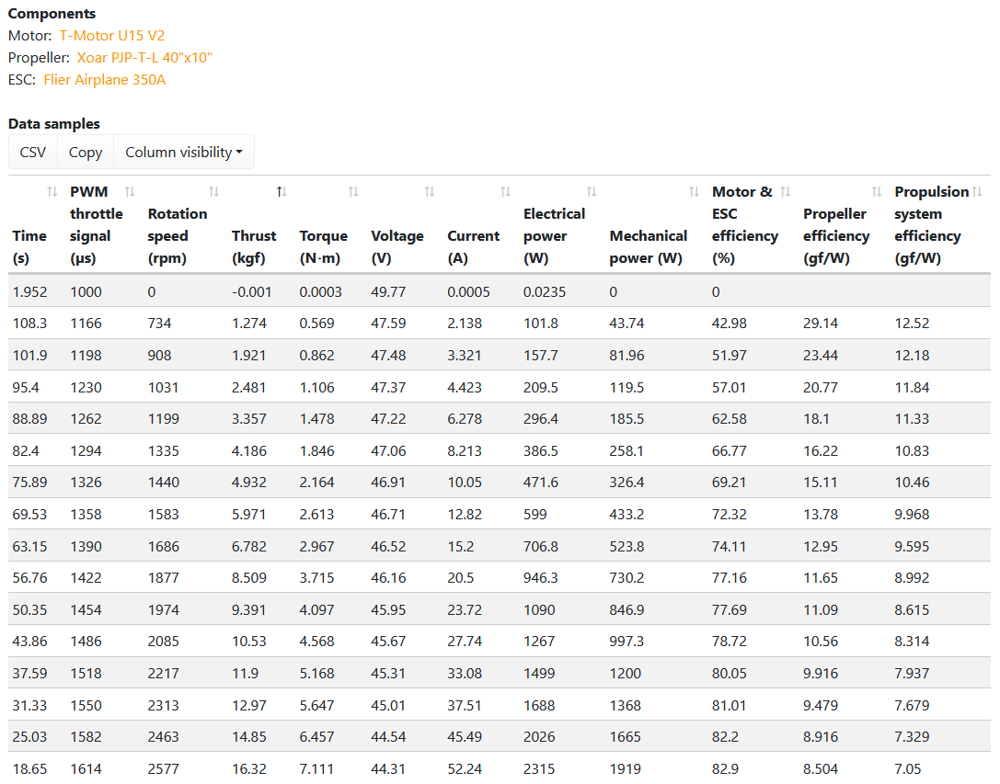

************************************************
In the Beginning. . . 
************************************************

   .. raw:: html

      <iframe width="560" height="315" src="https://www.youtube.com/embed/3sEZKbwZzG8" title="YouTube video player" frameborder="0" allow="accelerometer; autoplay; clipboard-write; encrypted-media; gyroscope; picture-in-picture" allowfullscreen></iframe>

      

Credit Reidar Bernsten

What? 
======================

   .. raw:: html

      

      

      This document is an overview for the curious as well as an attempt to provide a quick start guide to  DIY wanna-be e-pilots. It is an experimental and unfinished work. It draws on the experience and expertise of e-pioneers such as Reidar Bernsten and Charles Allen. Engineering details derive from many sources, including pilot-engineers (Paul Martin) and others. 
     
      There is no attempt here to make $$$, and so shall it ever be. 
      

      

      <iframe src="https://www.youtube.com/embed/cE88z20-Oko" title="YouTube video player" frameborder="0" allow="accelerometer; autoplay; clipboard-write; encrypted-media; gyroscope; picture-in-picture" allowfullscreen></iframe>
       
      
Credit Charles Allen

      

      

Resources
---------------------------------

This document links to: 

* `This open source content on Github <https://github.com/teachamantofish/eharness>`_: Editable data sources: spreadsheets lists, calculators, glossary
* `OpenPPG forum: Similar concepts, great forum, lots of resources <https://openppg.com/?fbclid=IwAR04rX_1St1D1lqTpwBbaOdLskhpFOMahdXRiHXU1gmr4fSlUv0pwsC-RQg>`_
* `Community forum at hanggliding.org <https://forum.hanggliding.org/viewforum.php?f=31>`_
* Open-sourced projects: See :ref:`workingbuild`.
* FaceBook pages: 

  * `ePowered Hang Glider <https://www.facebook.com/groups/904566026835865>`_
  * `FLPGH <https://www.facebook.com/groups/FLPHG>`_

* Future work: Several websites by others are in progress. I've ping USHPA about future articles, etc.  

Why? 
=====================

Why eharness? Because for 2000 or 3000 bucks a you can build a 20 pound eharness and flatland foot launch. No mountain. No towing. No modified glider. No tow rig.  The time and $$$ investment quickly pays for itself through reduced driving to launches, hang-waiting, tow costs, and alcoholic consumption while Jonesing for airtime. Only the pilot can determine the ultimate payback.

The systems are relatively simple and free of tune ups, maintenance hassles, and fossil fuels. Like most flight, there are some caveats and hazards, but the eharness idea has one moving part and many advantages. A community of pioneers are paving the runway with free advice, open source plans, and Youtube videos. Meanwhile, the multi-billion dollar drone, battery, and EV industries are driving the evolution of cheaper, lighter, and more powerful components. xx

Goals
-----------------------

* **Support DIY development**: An overview and concise details of existing projects will hopefully engage the community, increase participation, speed new approaches, and improve safety. Let's open some doors and remove the barriers.
* **Advance the technology**: Easily accessible information should speed and foster the development and use of functional designs. There's no need to reinvent the wheel, but there is a need to improve the wheel and invent some wheel alternatives.
* **Encourage growth in the sport of hang gliding**: The decline of hang gliding is well-known. Perhaps the ability to flatland launch with a simple DIY system will invigorate the sport. 

Danger Will Robinson
---------------------------

.. caution:: You assume responsibility for any action you take. This content may be in error. Adding an electric harness to an already hazardous sport only compounds the risks. Wise pilots make educated decisions based on multiple sources. There is no advice here. Much of the information here derives from 3rd parties.

Who?
=============

This author started out knowing nothing, and still knows little. I'm documenting my learning experience and pulling together resources I believe will benefit those starting at ground zero. Ideally, these pages will become a crowd-sourced document. You can contribute via the **Email** links or ask to edit the source on Github. Without community participation, this document will likely fade.

If you see your photo/text
------------------------------------

If you see text or images here that originated with you and want it removed, just ask. I can add credits and links back to your FB or home page if you prefer. 

Somewhere, "Over the Rainbow"
====================================

In Kansas there are no kits and plans. Neither is there detailed **and accurate** power train data that allows us to accurately predict a prop's output power/thrust for any given input power. These numbers will never come from manufacturers. 

3rd parties such as  `Tyto Robotics <https://database.tytorobotics.com/>`_ sell engineered test benches and provide free software which makes it possible to quantify motor/prop performance. But, it's still DIY. For the foreseeable future, insight into system performance and design will continue to derive from a mix of manufacturer data, anecdotal reports on forums, and pilots like Paul Martin (an engineer), Reider Bernsten, Charles Allen, and others.

   Credit Tyto Robotics

