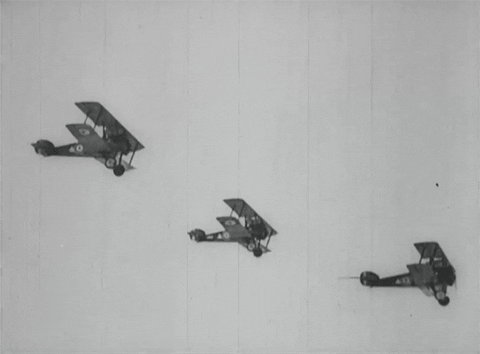

************************************************
Motors
************************************************

   Under construction

TBD: Intro

Motor specification wrestling 
===============================

You don't have to do it naked, but you do have to do it. Data sources are sketchy,

* Continuous current: How many amps the motor can handle for the number of minutes specified by the manufacturer until it overheats. Varies widely. You may need "continuous" for your climb duration. It's a good idea to design a system that's operates around 50-70% of max current during climb to reduce heat and allow for power headroom. 
* Max current: How many burst amps you can draw at full throttle. Design  a system that does not exceed the max current for the short time specified by the manufacturer (often 60 seconds).
* N and P numbers: something like “36N30P”. The number before the letter N is the quantity of electromagnets in the stator, and the number before P is the quantity of permanent magnets in the motor.  Lower KV motors have more permanent magnets to increase torque.
* Dimensions: TBD
* Internal resistance: Lower is better since resistance = heat. 
* Max torque: TBD
* No load current: TBD
* Max power: TBD

Other items you might care about are beyond the scope of this document, including thickness of the magnet laminations, magnet type, number of poles, wire pressure test, max temps for wire and magnets, etc. 

.. list-table:: 
   :widths: 10 10 30 50 
   :header-rows: 1

   * - Parameter
     - Typical range
     - Definition
     - Design considerations
   * - Price
     - 400-2000
     - Personal choice. 
     - Could be worth starting out with a cheaper motor and working up. 
   * - Weight
     - 3.1-12 lbs
     - Personal choice. 
     - Weight doesn't impact performance much, but the mass is hanging off the end of your harness (with a support strap).
   * - Rated voltage
     - 44-100V
     - Maximum either as volts or S rating. (``S number x 3.7volts``)
     - Higher voltages result in lower current and less heat and spin the prop faster (``Kv x volts = RPM``).
   * - Kv
     - 50-150
     - Number of revolutions per volt Kv stands the *constant velocity*.
     - o
   * - l
     - d
     - j
     - o
   * - l
     - d
     - j
     - o
   * - l
     - d
     - j
     - o
   * - l
     - d
     - j
     - o
  
Motor spec reality check
===================================

https://docs.google.com/spreadsheets/d/1FH4-bkdy-QprqCLcT0qVcDtsozDueq1GcB6CFJpJepM/edit#gid=1953445286

Duty cycle-max continuous power
----------------------------------------

There is also a suggestion that the lower the no load kv value of the motor the greater the 100% duty cycle reduction factor. Probably useful to know if one of the larger diameter 35kv or 27kv motors marketed for use on paramotors is being considered.

KV reduction
---------------------------

.. figure:: images/kvreduction.png

Example motor list
================================

Unfortunately, comparing motors based on published specs is as difficult as walking up an `Escher staircase <https://en.wikipedia.org/wiki/Relativity_%28M._C._Escher%29>`_. Note the following: 

* For reference: Mosquito 10.4 kw, Wasp 10.4kw, Mossi 11.2kw: but an IC engine has a 100% duty cycle and can continuously run at full throttle. DC power trains are limited to max continuous power limitations (heat).
* Some motors are marketed by others at higher prices. For example, APS sells Freerchobby motors. It's worth checking Alibaba, Amazon, eBay
* Don't blindly trust published data. 
* Some data points are undefined. For example, "continuous current" doesn't mean much unless you know the time frame. Some vendors user 1 minute, others 2 to 5 minutes or more.
* Thrust values derive from static thrust on a test stand with a specific prop. Dynamic thrust (when moving through the air) is far less. You'll have to use a combination of math, data table reading, and dice rolling to formulate an idea about what's likely true. You should have already calculated what you need; for example: 25Kg of thrust at 50-70% throttle for 5 climb minutes with 12s batteries to climb to 1000'. 
* RPM varies by Kv, voltage, and load. You need to determine this yourself or accept the numbers a manufacturer provides for a specific propeller. 
* The table below is a starting point only. Begin there, but don't end there.

`View, edit, and copy the spreadsheet <https://docs.google.com/spreadsheets/d/1O1r8choAQuhgh6FGf203ebjBLAv3VeXi2KZuJlWuQi4/edit?usp=sharing>`_

.. raw:: html

    <iframe src="https://docs.google.com/spreadsheets/d/e/2PACX-1vQhR018PYGnwq3c4SutTPxaxsnW6ntWMzfDsuU8Agrequ80ewUuX2cIUdyqLT0PZ_8bVPueNUx7XuHA/pubhtml?widget=true&amp;headers=false" width="100%" height="800px" frameBorder="no"></iframe>

Custom motors
======================

Custom rewinds change the KV rating and RPM.

* `Rewind your own motor <https://www.youtube.com/watch?v=-sIVpOLYoqg&t=144sA>`_
* Low cost custom KV: MAD motor, Alien Power Systems/Freerchhobby
* Zero cost custom KV: T-motor, Herlia
* Charles Allen reports that APS provided a custom motor with a hollow shaft for ~$25 extra so he could use a rod to articulate a variable pitch prop. 

Sensored versus sensorless
=============================

You don't need a sensored motor. While sensorless brushless motors perform poorly at low speed, their performance at flying speeds is excellent. ESC manufactures improve efficiency and performance by using sensorless synchronization at high speed to alter the timing for the sequence of power pulses sent to the motors windings. Sensorless motors are lighter, less complicated, and less prone to failure.

Mating with a prop
============================

See :ref:`prop`. 

Unfortunately, the the 36"-44" range of HG eHelp props are 10-20% smaller than powered paramotor props--meaning we can't leverage PPG  forums and vendor data as information sources. Still, the `e-props folks <https://ppg.e-props.fr/index.php?cPath=1>`_ match multiple props to each specific IC and electric motor. It's worth checking out to get an idea of acceptable combinations.

Worthwhile reading
========================

Basics
------------------

* `Motor basics <https://oscarliang.com/quadcopter-motor-propeller/>`_
* `Awesome motor videos <https://www.youtube.com/c/RCexplained/videos>`_: 

    * `KV and efficiency video <https://www.youtube.com/watch?v=WqlQJw9YXhE>`_: Motor resistance (ohms) waste heat = P=I*I*R. Lower KV = more windings = supports higher voltage = smaller wire = more resistance (and waste heat/power loss) = same power at less amps. 
    * `Kt, torque, volts, amps video <https://www.youtube.com/watch?v=xi7jxIkX2vY>`_: Kt = 1/kv (torque constant) not the same as actual torque: Torque = kt*I. The same motor at different Kvs doesn't change the output torque. Volt and amps can change, but V*I won't change.
    * `Motor size and torque <https://www.youtube.com/watch?v=k2VDvL4wtJs>`_: Diameter vs length. T = F*D. Bigger diameter motors procude more torque (basically more leverage), but so to longer motors.
    * `Reason to run motors on rated voltage <https://www.youtube.com/watch?v=0W07RLdj6w4>`. Lower voltage = lower input power. Calculations explained. 
    * `KV, efficiency, and changing voltage <https://www.youtube.com/watch?v=uRZlX6t7Xv4>`_. Measuring efficiency as voltage changes for different Kv motors. High rpm (high kv) is less efficient than a low Kv, higher voltage set up. Trade off is a heavier battery and bigger ESC.  

Advanced topics
-----------------------

* `Motor mass, size, and waste heat <https://community.openppg.com/t/paraglider-self-launching-system/2186/41>`_
* `Stator laminations <https://forum.hanggliding.org/viewtopic.php?t=35303>`_: Without super thin stator lams, efficiency suffers at high RPMs. But cheaper motors such as Freerchobby motors use 0.35mm lams because thin stator lams are very expensive (with the exception of Rotomax 150 at 0.2mm lams). Eddy losses in the iron stator core induced by the magnetic field switching as the rotor magnets fly past are proportional to the square of the lamination thickness x the square of the rpm. This why motors with thick lams can suddenly slam into an RPM wall and just turn into heaters without going any faster.

Vendor specific
----------------------

* MAD motor quality discussion: https://community.openppg.com/t/electric-ppg-one-motor-project/2596/26
* Geiger docs: 

  * https://www.geigerengineering.de/en/avionics/downloads
  * https://community.openppg.com/uploads/short-url/z9MJbg8s0FVoaRLhLJGppvysBao.pdf
  * https://community.openppg.com/uploads/short-url/20r15azC5ZyuEw0qG1rehnrVrVY.pdf
  * https://community.openppg.com/uploads/short-url/AmbK6TvFtUvk00lRsNZhH0MNywT.pdf

