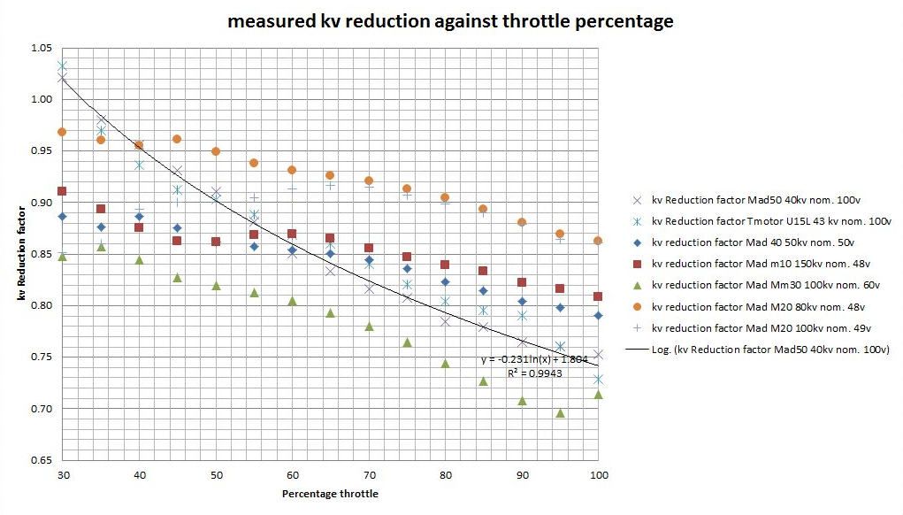

************************************************
Motors
************************************************

.. figure:: images/uc1.gif

Top considerations
==========================

* Total power is power minus heat. Heat is bad. Design for less heat: higher volts, less amps, largers wires, lots of headroom in all components, cooling, etc.
* Higher voltage and lower current is more efficient as electrical losses (heat) is proportional to the square of the current.
* Speed increases proportionally with the operating voltage.
* Torque increases proportionally with the current consumed.
* Engine power increases approximately proportionally with the speed. This means that the highest power can only be used at maximum speed (From Lehner).

Reading motor specs
============================

* N and P numbers: something like “36N30P”. The number before the letter N is the quantity of electromagnets in the stator, and the number before P is the quantity of permanent magnets in the motor.  Lower KV motors have more permanent magnets to increase torque.
* Dimensions: 
* Rated voltage: Provided in either volts or an S rating. (``S rating = number*3.7volts``)
* KV: Number of revolutions per volt. You'll like want 50-150. 
* Continuous current: How many amps the motor can handle for the number of minutes specified by the manufacturer until it overheats. Varies widely. You may need "continuous" for your climb duration. 
* Max (burst) current: How many amps you can draw 
* Internal resistance: Lower is better since resistance = heat. 
* Max current: You need to spec a system that does not exceed the max current. Moreover, max current is limited to a short period of time (usually minutes). It's a good idea to design a system that's operates around 50-70% of max current most of the time. 

  

Example motor list
================================

Unfortunately, comparing motors based on published specs is like comparing apples and maggots. Note the following: 

* For reference: Mosquito 10.4 kw, Wasp 10.4kw, Mossi 11.2kw: but an IC engine can run 100% and elec continuous power is far less.
* Some motors are marketed by others at higher prices. For example, APS sells Freerchobby motors. It's worth checking Alibaba, Amazon, eBay
* You can't trust published data. 
* Some data points are undefined. For example, "continuous current" doesn't mean much unless you know the timeframe. Some vendors user 1 minute, others 2 to 5 minutes or more.
* Thrust values are static thrust on a stand. In flight, dynamic thrust is far less. Published data varies by volts, amps, RPM, and propeller. You'll have to use a combination of math, guessing, data table reading to formulate an idea. You should have already calculated what you need; for example: 30Kg of thrust at 50-70% throttle for 5 climb minutes with 12s batteries to climb to 1000'. 
* Max RPM is a no load number. RPM in data tables reflect a value for the specific test propeller. 
* The table below is a reference point only. You can start there, but don't end there.

.. raw:: html

    <iframe src="https://docs.google.com/spreadsheets/d/e/2PACX-1vTZ5drQYvvp4srNMViieF0J0stG8gvPEdH_B7djQA4lOQ53DEMxsOmvscQ4TEEQP2fW-wIQpMl-eO5L/pubhtml?widget=true&amp;headers=false" width="100%" height="850px"></iframe>

Sensored versus sensorless
=============================

You don't need a sensored motor. While sensorless brushless motors perform poorly at low speed, their performance at flying speeds is excellent. ESC manufactures improve efficiency and performance by using  sensorless synchronization at high speed to alter the timing for the sequence of power pulses sent to the motors windings. Sensorless motors are lighter, less complicated, and less prone to failure.

Mating with a prop
============================

Criteria: 

#. one
#. two
#. three

The `e-props folks <https://ppg.e-props.fr/index.php?cPath=1>`_ match multiple props to each specific motor. It's worth checking out to get an idea of acceptable combinations.

Duty cycle-Max continuous power
===============================

There is also a suggestion that the lower the no load kv value of the motor the greater the 100% duty cycle reduction factor. Probably useful to know if one of the larger diameter 35kv or 27kv motors marketed for use on paramotors is being considered.

KV reduction
========================

Custom motors
======================

Custom rewinds change the KV rating and RPM.

* `Rewind your own motor <https://www.youtube.com/watch?v=-sIVpOLYoqg&t=144sA>`_
* MAD motor and Alien Power Systems will motors rewind for low cost.
* Charles Allen reports that APS made him a custom motor with a hollow shaft for ~$25 extra so I could have a rod go through to articulate a variable pitch prop. 

Worthwhile reading
========================

Basics
------------------

* `Motor basics <https://oscarliang.com/quadcopter-motor-propeller/>`_
* `Awesome motor videos <https://www.youtube.com/c/RCexplained/videos>`_: 

    * `KV and efficiency video <https://www.youtube.com/watch?v=WqlQJw9YXhE>`_: Motor resistance (ohms) waste heat = P=I*I*R. Lower KV = more windings = supports higher voltage = smaller wire = more resistance (and waste heat/power loss) = same power at less amps. 
    * `Kt, torque, volts, amps video <https://www.youtube.com/watch?v=xi7jxIkX2vY>`_: Kt = 1/kv (torque constant) not the same as actual torque: Torque = kt*I. The same motor at different Kvs doesn't change the output torque. Volt and amps can change, but V*I won't change.
    * `Motor size and torque <https://www.youtube.com/watch?v=k2VDvL4wtJs>`_: Diameter vs length. T = F*D. Bigger diameter motors procude more torque (basically more leverage), but so to longer motors.
    * `Reason to run motors on rated voltage <https://www.youtube.com/watch?v=0W07RLdj6w4>`. Lower voltage = lower input power. Calculations explained. 
    * `KV, efficiency, and changing voltage <https://www.youtube.com/watch?v=uRZlX6t7Xv4>`_. Measuring efficiency as voltage changes for different Kv motors. High rpm (high kv) is less efficient than a low Kv, higher voltage set up. Trade off is a heavier battery and bigger ESC.  

Advanced topics
-----------------------

* `Motor mass, size, and waste heat <https://community.openppg.com/t/paraglider-self-launching-system/2186/41>`_
* `Stator laminations <https://forum.hanggliding.org/viewtopic.php?t=35303>`_: Without super thin stator lams, efficiency suffers at high rpms. But cheaper motors like APS/Freerchobby motors use 0.35mm lams because thin stator lams are very expensive (with the exception of Rotomax 150 at 0.2mm lams). Eddy losses in the iron stator core induced by the magnetic field switching as the rotor magnets fly past are proportional to the square of the lamination thickness x the square of the rpm. This why motors with thick lams can suddenly slam into an RPM wall and just turn into heaters and not go any faster.

Vendor specific
----------------------

* MAD motor quality discussion: https://community.openppg.com/t/electric-ppg-one-motor-project/2596/26
* Geiger docs: 

  * https://www.geigerengineering.de/en/avionics/downloads
  * https://community.openppg.com/uploads/short-url/z9MJbg8s0FVoaRLhLJGppvysBao.pdf
  * https://community.openppg.com/uploads/short-url/20r15azC5ZyuEw0qG1rehnrVrVY.pdf
  * https://community.openppg.com/uploads/short-url/AmbK6TvFtUvk00lRsNZhH0MNywT.pdf

Notes, todo, not reviewed
=================================

Paul Martin: 
-------------

If you want a quick sizing guide. 

14s set up coupled to a 75/300A controller coupled to 

* a 120100 80 to 85kv and a 40D18P propeller will get you between 200 and 250 fpm climb. 
* 15470 even with it limited to 55kv ( though I reckon you could get it rewound) of 16s li-Po you'd have more torque and still have 3700 rpm. A bigger prop would be handy but it might be custom even so with the 40D20P you would be around 48kgf thrust on 250A draw which equates to about 38kgf at 12m/s which gives you over 400 fpm climb rate. Hope that helps

