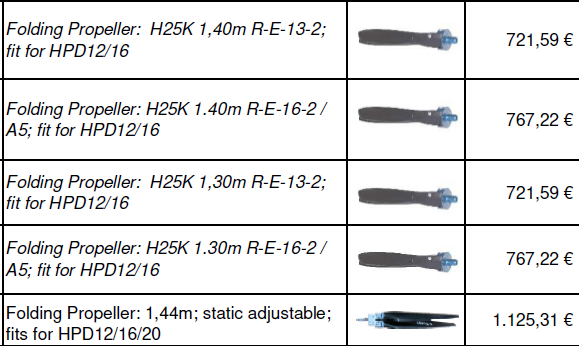
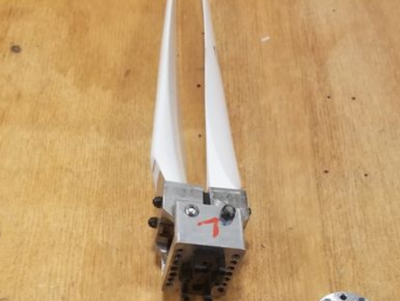
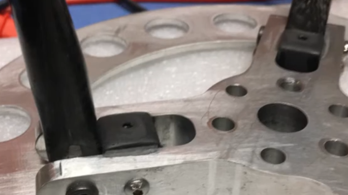

.. _prop:

************************************************
Propellers
************************************************

.. figure:: images/uc3.gif
   :scale: 30%

   Under construction

I'm going to punt here for a while. The topic is complex. This section includes some rules of thumb and links to folks who know more (and don't often agree). It's worth reading a `prop overview <https://aerotoolbox.com/thrust-cruise-speed/>`_ as well as what `e-props has to say <https://ppg.e-props.fr/efficient_prop/#tit03>`_.

Driveline design often starts with the prop. To fly, you need to move a mass of air in the opposite direction. Bigger is better but you have to worry about toes, keel, and ground. Faster is *sometimes* better but there are limits. Prop pitch (the angle that determines the bite into the air) should be selected for your airspeed and either climb or cruise. The prop is going to slow your motor down, and it's design must be compatible with the motor's power and speed. 

Your driveline decisions about motor, power source, and propeller are intertwined. You'll need to verify they work together to achieve your goals. 

Getting started
==========================

In general, you can do what other folks are doing or use your motor's manufacturer recommendations.

* Slower speeds and bigger propellers produce more thrust. 
* Static thrust (not moving) is always far higher than dynamic thrust. 
* Don't trust manufacturer numbers. 
* A higher pitch performs better during climb and slow speeds. Design for climb or cruise. 
* A 150kv 34x14 setup *could be somewhat* similar to an 80kv 36x16 setup. In other words: Spin smaller and lower pitch props faster and vice versa. 
* More blades might yield a bit more thrust (e.g. 5%), but it's more drag if they don't fold.
* Carbon fiber is stronger, lighter, more responsive as well as more expensive. 
* Wood is cheap and a good choice for learning, experimenting, and conditions where damage is likely. 
* Typical sizes range from 36"-44". Pitches range from 14-20.
* eCalc recommends props with their configurations.

TBD: insert pitch/d diagram

Choosing a propeller
==========================

Choosing a propeller requires knowing how much thrust you need for a specific flying goal; for example, a 300 fpm climb at 24 mph. You'll need to know some basic numbers about your wing and go through the basic calculations here TBD. 

Diameter
---------------

Prop design is a rabbit hole this document avoids, and bigger is better for a variety of reasons too complex to go into here. Choose a prop that's as large as you can make it safely. Most eHarness props are around 40", with sizes ranging from 36" to 52". Required steps: 

#. Determine your size. Avoid creating hazards out of the ground, body, and keel. 
#. Match the prop to the motor. The prop is the load. It will slow down your motor and could overload it these components are not matched. Refer to the TBD sizing calculator. 
#. Verify the tip speed does not exceed .7 mach (the speed of sound). Opinions will vary on max speed, but the point is efficiency suffers dramatically as the tip speed nears mach. See the TBD calculator. 

These short videos are a must watch: 

* Reidar Bernsten's `video comparison <https://www.youtube.com/watch?v=WgNMc35zqYo>`_ of two systems using identical motor and batteries:  

  * System 1: 26kg thrust, 168 amps, 36" prop: climb: 1 meters/second
  * System 2: 40kg thrust, 138 amps, 52" prop (geared): climb: 2 meters/second

* Must watch 2:00 to 4:40: `Why choose a larger propeller <https://www.youtube.com/watch?v=6e4x2vj9H9U>`_:

.. raw:: html

   <iframe width="560" height="315" src="https://www.youtube.com/embed/6e4x2vj9H9U?start=120" title="YouTube video player" frameborder="0" allow="accelerometer; autoplay; clipboard-write; encrypted-media; gyroscope; picture-in-picture" allowfullscreen></iframe>

Pitch
------------------

TBD: diameter to pitch ratio

A quick aside on the prop pitch thing: I was running a fixed wing UAV development program for a while and we ended up settling on that same 3:2 diameter to pitch ratio for maximum endurance. That is usually about the highest pitch you can get without stalling the prop blades at zero airspeed. Pushing the pitch higher will continue to increase the specific thrust (grams of thrust per watt) even higher, but weird things start happening when the prop disc is stalling, or stalling unevenly with uneven airflow. 3:2 seemed to be the magic ratio for that vehicle, and it seems (according to eCalc) to be the magic ratio here as well.

Number of blades
------------------------

More blades may provide  more “bite” to the air which improves climbing performance. But increases in power also produce more drag. Drag is bad for speed, so two blades are better for cruising speed. Three is a nice blend of the two, sacrificing a little speed for better climb. That why you see two blades mostly on small planes with low power (by low I mean under 800 HP) engines.

e-Props claims their  3 blade props deliver 3-6% more thrust at the same diameter. 

Resources: 

  * https://community.openppg.com/t/tri-vs-bi-prop-efficiency/3944
  * Also see PPG Youtube videos comparing configurations.
  * `e-Props data <https://aircraft.e-props.fr/efficient_prop/#tit02>`_.

Propeller calculators
===================================

Use what you know. In this case, 30kg of thrust

* `ecalc <https://www.ecalc.ch/setupfinder.php>`_: 38x17 to 40x22 2 blade; 39x19 or 20 3 blade
* `static thrust calculator <https://www.poweredparagliders.com.au/Calculators/Static_Thrust_Calculator.htm>`_: 40x22
* https://web.archive.org/web/20200707141236/http://www.godolloairport.hu/calc/opc_eng/index.html
* Plug in your prop choice and motor data to verify thrust
* 
    * `e-props:  <https://ppg.e-props.fr/calculator_PROPS.php?language=en>`_
    * https://rcplanes.online/calc_thrust.htm

* `Mejzlik prop calculators <https://www.mejzlik.eu/technical-data/propeller_calculatorf>`_

    * Disk loading
    * Dynamic thrust
    * Static thrust

Folding props DIY and resources
============================================

Commercial
-----------------

* `Icarus folding props <https://icare-icarus.3dcartstores.com/RASA-CFK-3-Blades-Propeller-Folding-342225-MAG-CAD-BIG_p_852.html>`_. See also Reidar's `video and commments <https://www.youtube.com/watch?v=-sIVpOLYoqg&t=144s>`_
* `MAGCAD 2 and 3 bladed folding props <https://magcad.de/?tag=propeller>`_
* `Geiger folding props (expensive) <https://www.geigerengineering.de/_Resources/Persistent/625177aac067c72b7020a8390f7c7de9d3d340e7/EDrive%20Flyer%20technische%20Merkmale%20V1_1.pdf>`_

   Credit: Geiger

DIY
---------------

* `Folding prop hub design <http://graal-aero.fr/hub_e.html>`_
* `Forward folding prop  <https://www.youtube.com/watch?app=desktop&v=wuhSRdffuDw&t=295&fbclid=IwAR1d04qJ8gJxdnokDxZHgMgBG0L7G1J2QcmDmnfWWiDHTK9bdoyb82HxvZg>`_
* `Charles Allen's DIY project video <https://www.youtube.com/watch?v=cyBJLpHkc7A>`_

   Credit: Charles Allen

* `DIY folding prop hub <https://www.youtube.com/watch?v=d3AuHhnzxZA>`_

   Credit: Brendan

Propeller innovation
================================

* `Passive variable pitch prop: <https://www.facebook.com/groups/904566026835865/permalink/944285446197256>`_

* Contra-rotating prop: 
    * `Commercial offering <https://www.crflight.com/?utm_source=unmannedsystemstechnology.com&utm_medium=referral>`_
    * `PPG discussion: <https://community.openppg.com/t/co-axial-motors-with-counter-rotating-props/114>`_
  
* `Propeller hub <https://www.f3aunlimited.com/airplane-accessories/falcon-82mm-carbon-fiber-spinner-with-cnc-cooling>`_. Functional but for tractor setups only. 

Vendors
==================

* eProps: Extensive line of PPG props with 2-6 blades. Super light but smallest is 115cm: https://ppg.e-props.fr/index.php?cPath=1
* Extensive line with 2-4 blades: https://ultraprops.com/
* https://www.mejzlik.eu/product: 2 and 3 blade. Offers one 40x13. 
* `Aircraft International (all types) <https://www.aircraftinternational.com/Products/Propellers.aspx>`_
