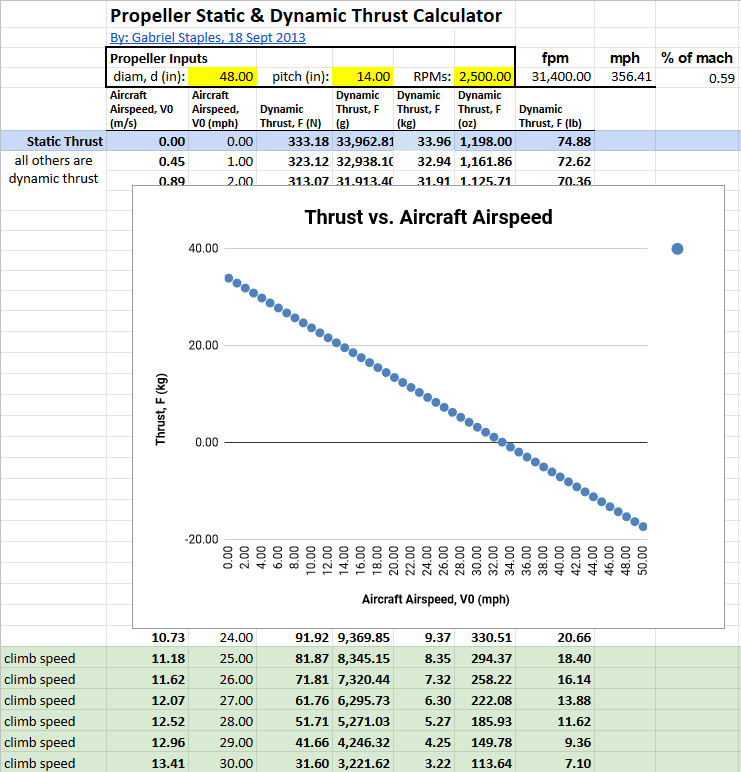

.. _spec:

************************************************
Specing out a System
************************************************

.. figure:: images/uc2.gif
   :scale: 40%

   Under construction

Navigating a working system is difficult and time consuming. Until the eharness harness idea is more widespread, design principles will remain relatively inaccessible while advice is scattered across various Facebook pages and forums with pioneers helping where they can. With luck, the eharness paradigm will gain enough traction that the hang gliding community can emulate aspects of `OpenPPG <https://openppg.com/>`_ and create its own easy-to-traverse path.

Until then, moving forward is a bit of work. 

Margins are thin with electric powered aircraft primarily due to battery low energy density. While HG trike and paramotor systems can carry several KWH of batteries, HG harness systems are limited by what a pilot is willing to carry (e.g. sub 2 KWHs). Powered flight time is measured in minutes--often 10 to 20. Couple these limitations with a wide range of wing specs and pilot weights, and it becomes apparent that optimizing the power train requires some minimal number crunching. At a 200 fpm climb, there's a big altitude difference between 5 minutes and 10 minutes.

Decision path
=====================

You'll often hear that system design starts with the prop. However, system component performance is delicately intertwined and a change in any component specification is likely to have ramifications for the rest of the power train. Your choice of batteries, motor, electronic speed controller, or prop must inform your choices across the system. Failure to balance and tune the design holistically can easily result in a dangerous or inadequate eharness system.

Realistically, it doesn't matter where you start as long as the entire system produces the desired result. For example: 

* *Batteries*: How much weight you're willing to have on board determines available power. Do you want to stay under 60 volts due to a wider array of available products or for safety reasons? Or should you choose 24S (88-100V) system so you push less amps and produce less heat for the same power?
* *Motors*: Motors must be rated for the voltage you choose. They'll need to be able to drive your propeller at enough thrust while handling the continuous amperage during climb without overheating. In other words, they must be spec'd to handle the battery input power while delivering enough output power to the prop.
* *Propeller*: The prop pushes you into the sky with thrust. Larger diameters and slower speeds are more efficient, but the motor must be capable of turning the prop at the required speed and torque. Ground, feet, and keel limit prop size, and within the standard 36-44 inch range there are hundreds of choices (diameter, pitch, blade number, and material). Volts determine speed, but amps determine torque.

Top considerations
-------------------------------

.. list-table:: 
   :widths: 30 70 
   :header-rows: 1

   * - What?
     - So What?
   * - Total power is power minus heat. Heat is bad. 
     - Design for less heat: higher volts, less amps, larger wires, lots of headroom in all components, cooling, etc.
   * - Higher voltage is more efficient as electrical losses (heat) is proportional to the square of the current.
     - Choose the highest voltage your willing to work with and carry. In Europe, 60v is a mandated max. Higher voltage increases the ability of current to go through your body. Higher voltages mean you have fewer battery choices. 
   * - Torque increases proportionally with the current consumed.  
     - Current is equivalent to amps. Amps create heat. Design requires balancing volts and amps via your choice of motor and prop. 
   * - Speed increases proportionally with the operating voltage. Engine power increases approximately proportionally with the speed. The highest power can only be used at maximum speed.
     - However, large, slow propellers are more efficient. You're limited by a keel and ground. Tip speed should also stay below .8 mach. 

.. todo: insert tradeoff diagram

The tradeoff game
---------------------------------

TBD: Todo: insert table showing how a change in one variable impacts the system. For example, more volts results in less amps for the same power. More amps results in more heat. Etc. 

.. note:: Before investing time and money, however, a logical first step could include figuring out what it will take to get your butt into the sky. . . 

Calculator: Kilowatts to goal
============================================

Method 1: Focus on efficiency
--------------------------------------------

**Theoretical power x efficiency**: This approach calculates the theoretical energy  to transport you to an altitude within a given time frame and then adjusts for power train efficiency. For example: If Joey Pilot with is Sport 3 Race and and gear weighs 300lbs, how many kilowatts of battery power will it take to climb at 200 fpm to 1000'?

.. raw:: html

   <iframe src="resources/calculator_power.html" id="calctheory" scrolling="no"  frameBorder="0" width="900"></iframe>

**Calculation walk-through** 

1. The first step calculates the theoretical energy required when the power train is 100% efficient. If a stone was hanging out at 1000 feet, how much energy does it store? Note that the formulas are metric (newtons, joules, and Earth's gravitational constant (9.8 m/s squared), so we convert 1000 feet to meters by dividing by 3.28. 

The formula is: ``kwh=weight X 9.81 (gravity) X feet/3.28 (convert to meters) X 1000 watts X 36000 (sec. per hour)`` 

1. Next, we adjust for reality since no part of the system is 100% efficient. The calculator provides some reasonable guesstimates. Multiply the efficiency of all components to get the correction factor. 
2. We can now calculate needed energy and power: 
 
  * Energy: Obtain the needed kwh by dividing the previously calculated theoretical Kwh by the efficiency correction factor. 
  * Power: Determine the rate of the power draw by dividing the total needed kwh by number of climb minutes by 60 minutes in an hour: ``kwh/(climb time/60)``. A 5 minute climb to 1000' is simply a 200 fpm climb rate.

4. Now pick some batteries and calculate how long you can draw power at the specified rate. These fields require knowing whether your system is wired in series, parallel, or both. 

  * System voltage is the voltage sent to the motor. Add the voltage of batteries connected in series. 
  * milliamp hours is the amp rating you can draw: Add the amps of any batteries in parallel. 
  * By default, the calculator uses a common set up of 2 6s 22000mah batteries (22v) in series. That's one string of batteries with a 44v and 22000mAH output.

Method 2: Focus on lift and drag
-------------------------------------------

**Prop and thrust**: This approach arrives at required Kwh to an altitude based on a desired climb rate and the amount of power it takes given the calculated drag and coefficient of lift.

.. tip:: Live version coming soon! Until then, copy and use `the original <https://docs.google.com/spreadsheets/d/1ij-Vy3835dhY8Kqg17O_BWjjIVHlTOPBIy46ROsu4YE/edit?usp=sharing>`_.

.. raw:: html

   <iframe src="https://docs.google.com/spreadsheets/d/e/2PACX-1vTNk3d16kUlG7Y17k-Ii-QV9PyIXVCnGImD2lEwtXD6sR2HUV1zLu5W5cmfS6Fer3r2_RfJyQ8oOVRR/pubhtml?widget=true&amp;headers=false"  scrolling="no"  frameBorder="0" width="700px" height="970px"></iframe>

Calculator: Battery volts & amps
===================================================
 
.. tip:: Live version coming soon! Until then, copy and use `the original here <https://docs.google.com/spreadsheets/d/1ij-Vy3835dhY8Kqg17O_BWjjIVHlTOPBIy46ROsu4YE/edit?usp=sharing>`_.

.. raw:: html

    <iframe src="https://docs.google.com/spreadsheets/d/e/2PACX-1vTfsWeI0qIlAbYbaXaNGYnleZmtXnAgD0Pvbtdmn-Gi2WE_WTBSEzz8cQO_yhCsmRrs5oKbHpNX5LJ6/pubhtml?widget=true&amp;headers=false" scrolling="no"  frameBorder="0" width="800px" height="440px"></iframe>

Calculator: Prop diameter and pitch
=========================================

Prop selection is TBD and may remain beyond the scope of this document. One rule of thumb is you need at least 30kg of static thrust to achieve an adequate climb. 

.. note:: Paul Martin is apparently working on a prop calculator for hang gliders, but it's not currently available.

Most online calculators are marginally helpful and either target commercial or RC aircraft. Gabriel Staples perhaps the provides the best open source calculator. `Copy my version <https://docs.google.com/spreadsheets/d/e/2PACX-1vSsKtTxmMjx0vw2CVbIRzPMQq3d2xT3ZjYDwhM5pYH2NwoicSHgTynGQmZIe6s5Sg/pubhtml>`_ or get `the original <https://www.electricrcaircraftguy.com/2013/09/>`_. 

   Credit Gabriel Staples

Calculator: Prop tip speed
===========================

Propeller efficiency reduces as the tip speed approaches the speed of sound.  Beyond 80% of the speed of sound, increasing RPM has little affect on thrust. Ideally, keep tip speeds below 70% of Mach. Optimum efficiency and less noise stems from tip speeds less than 700 feet per second or 475 mph. Excess tip speed results in air compression in front of the prop leading edge which rapidly degrades propeller performance.

.. tip:: Live version coming soon! Until then, copy and use `the original file <https://docs.google.com/spreadsheets/d/1lHkmLChR1pkwir4u_RVsa-Cblb-_YRA0Q8wluVCTvjg/edit?usp=sharing>`_.

.. raw:: html

  <iframe src="https://docs.google.com/spreadsheets/d/e/2PACX-1vSdRRNQ5p8I63P3KzY7_yGY3y2QXIBEb62x6NzK7YvKKBwAsrspDv7rdQSWbgb_y_NCxmxuhaAMcpYu/pubhtml?widget=true&amp;headers=false" scrolling="no"  frameBorder="0" width="450px" height="180px"></iframe>

Putting it all together
============================

TBD