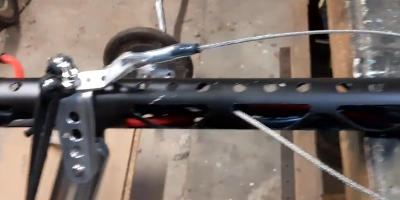
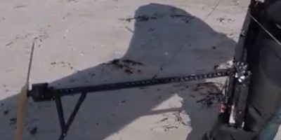
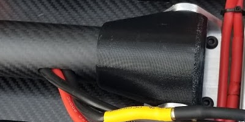
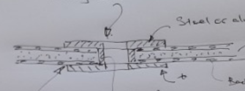
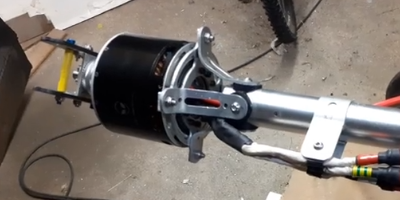
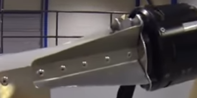
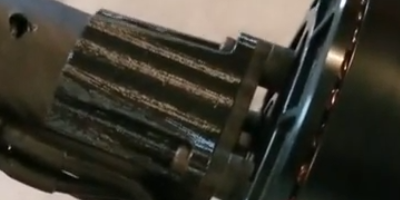
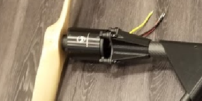
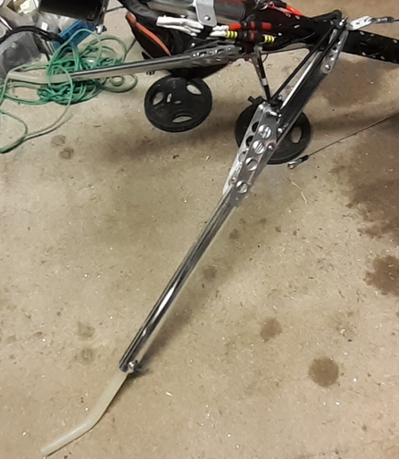

************************************************
Structural-Mechanical
************************************************

.. figure:: images/uc4.gif
   :scale: 30%

   Under construction

Backplate connection
==================================

TBD

Boom 
========================

While weights vary by diameter and wall thickness, carbon fiber is generally 200-300% lighter than aluminum. On the other hand, we don't need much material and aluminum is easier to work with. My approach is to use aluminum for the initial version and testing and CF for a final version. 

Paul Martin reports  that if you just want to bolt a tube on to get up and running anything, from 1.75” x 17 swg is fine (commonly used in old hang gliders).

TBD: Add link to Paul's engineering doc. 

   Credit: Paul Martin

   Credit: Reidar Bernsten

Boom to boom hinge connection
============================================

   Credit: Charles Allen

Backplate connection
==================================

TBD: explanation. We don't know the shear strength.

#. Make or buy a mechanical fastener that provides both a non-crushable metal bolt sleeve as well as a top and bottom surface for the fastener: T nut, weld nut, grommet, TBD. Stainless steel is NOT epoxy friendly. 
#. Mark and drill the backplate holes.
#. Abrade and degrease the backplate and fastener.
#. Bond with a high strength epoxy to both sides of the hole.
#. Clamp. Compressing with a nylon bolt may be easier than a tool.

   Credit: Paul Martin

Motor mount
======================

   Credit: Paul Martin

   Credit: Reidar Bernsten

   Credit: Charles Allen

 
   Credit: Charles Allen

Battery mounts
======================

TBD

Kickstand
======================

   Credit: Paul Martin

Safety features
===========================

See :ref:`safety`

Wheels
==================

* `Fenison FlyBar, Northern Tool Wheels <https://www.youtube.com/watch?v=npBn50XRphA>`_
* `Wheels from Oregon Hang Gliding <http://www.oregonhanggliding.com/wheels.shtml>`_
* `Example UHMW wheel mfg <http://www.pioneercastors.net/UHMW-PE-wheels.php>`_
* `Worth a look: rollerblade wheels (see All Terrain) <https://www.inlinewarehouse.com/fitlc/wheels/inline-wheel-buying-guide.html?from=gsearch&gclid=Cj0KCQiA2ZCOBhDiARIsAMRfv9JcTo6xq2XnzXZtbFxOVJDOL5OP7p2-DCL7usgi224nwBz6HVJbqUEaAhLIEALw_wcB>`_

Wheel pants, wheel fairings

* `Aircraft Spruce <https://www.aircraftspruce.com/menus/ap/wheelfairings.html>`_

Hang glider hardware
=============================

* `Downtubes <https://www.willswing.com/accessories/wills-wing-control-bars/>`_
* `Airfoil brackets (all types) <https://delta-goodies.com/product/speed-bar-and-upright-brackets-holders-6-8-mm>`_

Material supppliers
===========================

TBD: Random list. May kill this later. 

General suppliers

* `Hobby King <https://hobbyking.com/>`: Just about everything. 

Carbon fiber
---------------

* `Dragonplate <https://dragonplate.com/carbon-fiber-products>`_: Includes technical specifications, CAD drawings, and connectors
* https://www.clearwatercomposites.com/products/carbon-fiber-tubes/round/
* `Aliexpress source <https://www.aliexpress.com/item/688027936.html?spm=a2g0o.store_pc_groupList.8148356.4.2b9565c9ds2wgl>`_

Aluminum
------------------

* https://www.onlinemetals.com/

Aircraft parts
---------------------

* https://www.airpartsinc.com/default.asp
* https://www.leadingedgeairfoils.com/

Tubing
------------------

* https://www.shapirosupply.com/aluminum/tube-and-pipe?cat=27
* https://www.airpartsinc.com/default.asp
* https://www.leadingedgeairfoils.com/

1x1/8 wall t6061 tubing is .52lbs/ft; cf 1x1.125 is .87 for 6 feet

Couplers
-----------------

* PPG tubing fittings: https://epowerhobby.com/product/4-x-aluminum-paramotor-cage-90-degree-tube-connectors/
* https://www.kippusa.com/us/en/Products/Tube-Connectors.html

note, tbd, todo
=======================

Project update: After going back and forth on frame material I got some 1" aluminum EMT conduit. It’s 6005, roughly 27mm OD with 2mm walls. It seems plenty strong, it’s light, and it’s cheap! It can also be easily bent with a conduit bender. I’m going to bend up a frame in a day or two to check fitment on my harness.